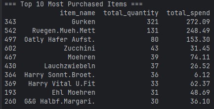

> [!NOTE]  
> Was bored and fiddled around with ChatGPT and my own receipt data.  
> Might improve/continue on this the next time I get bored.

# Edeka Receipt Analysis

A small project that parses PDF supermarket receipts (from Edeka), extracts structured data, and analyzes shopping insights. The solution is written in **Python** and uses [pdfplumber](https://github.com/jsvine/pdfplumber) for text extraction.

## Features

- **Automatic PDF Download**  
  Downloads receipts from your Gmail mailbox using the `mail_loader.py` script.

- **PDF Parsing**  
  Extracts text from receipts and converts them into structured JSON.
    - Identifies each item, including quantity, unit price, and total price.
    - Handles special cases like coupons, deposits (Pfand), and weight-based items (kg price).

- **JSON to CSV Conversion**  
  Converts the parsed JSON data into a CSV file for easier handling in Excel, Google Sheets, or further data analysis tools.

- **Data Analysis**  
  Performs aggregations and summaries (daily spend, items purchased, top items, etc.) using [pandas](https://pandas.pydata.org/).

## Example Output

### JSON Output

```json
{
    "store": "Edeka",
    "date": "2021-08-01",
    "time": "12:34",
    "items": [
        {
            "name": "Milk",
            "quantity": 1,
            "unit_price": 1.29,
            "total_price": 1.29
        },
        {
            "name": "Bread",
            "quantity": 2,
            "unit_price": 0.99,
            "total_price": 1.98
        }
    ],
    "total": 3.27
}
```

### CSV Output

| Store | Date       | Time | Item  | Quantity | Unit Price | Total Price |
|-------|------------|------|-------|----------|------------|-------------|
| Edeka | 2021-08-01 | 12:34| Milk  | 1        | 1.29       | 1.29        |
| Edeka | 2021-08-01 | 12:34| Bread | 2        | 0.99       | 1.98        |

### Console Output



## Repository Structure

```
.
├── .github/
│   ├── workflows/
│   │   ├── test.yml          # GitHub Actions workflow for running tests on PRs
├── output/
│   ├── autogenerated/        # All generated files are stored here
│   │   ├── analysis/         # Analysis outputs are saved here
│   ├── README.md
├── Receipts/
│   ├── PDFs/                 # Place your receipt PDFs here (see README in this folder)
│   ├── README.md
├── scripts/
│   ├── analysis/             # Scripts for data analysis
│   ├── parsers/              # Scripts for parsing receipts
│   ├── utils/                # Utility functions (file handling, etc.)
│   ├── scripts               # Main scripts to process receipts
├── tests/                    # Folder for unit tests
├── .gitignore
├── LICENSE
├── requirements.txt
└── README.md                 # This file
```

- **.github/workflows/test.yml**  
  Defines the GitHub Actions pipeline to run tests automatically when a PR is opened.
- **output/**  
  Stores all processed and generated files, including parsed JSON and CSV outputs.
- **Receipts/**  
  Contains all receipt PDFs. See the README in this folder for details.
- **scripts/**  
    - **analysis/**  
        Contains scripts for data analysis.
    - **parsers/**  
        Contains modules for extracting structured data from receipts.
    - **utils/**  
        Contains helper functions for file handling and processing.
- **tests/**  
    Contains unit tests for all major components.

## Installation

1. **Clone the repo**
   ```
   git clone https://github.com/LetsPoke/Edeka_Receipt_Analysis.git
   ```
2. **Set up a virtual environment (optional but recommended)**
   ```
   python -m venv venv
   source venv/bin/activate  # On macOS/Linux
   venv\Scripts\activate     # On Windows
   ```
3. **Install dependencies**
   ```
   pip install -r requirements.txt
   ```

## Usage

1. **Place your PDF receipts** in the `receipts/pdfs/` folder. or use the `mail_loader.py` script to download receipts from your gmail mailbox.
   ```
   python scripts/mail_loader.py
   ```
    - The script will download the latest receipt from your mailbox and save it in the `receipts/pdfs/` folder.
2. **Parse receipts** into JSON:
   ```
   python scripts/read_receipt.py
   ```
    - The output file (`parsed_receipts.json`) will be generated in the `output/autogenerated/` folder.
3. **Convert JSON** to CSV:
   ```
   python scripts/convert_receipt.py
   ```
    - The resulting CSV (`parsed_receipts.csv`) will be created.
4. **Analyze**:
   ```
   python scripts/analysis/run_analysis.py
   ```
    - Prints various summary statistics and aggregations to the console.
    - The output is also saved in the `output/autogenerated/` folder.
5. **Visualize**:
   ```
   python scripts/analysis/run_visualization.py
   ```
    - Generates various plots and visualizations based on the data.
    - The output is saved in the `output/autogenerated/visualizations/` folder.

## Contributing

1. Fork the repository.
2. Create a new branch for your feature or bugfix.
3. Submit a pull request.

## License

This project is licensed under the [MIT License](LICENSE).  
See the `LICENSE` file for details.